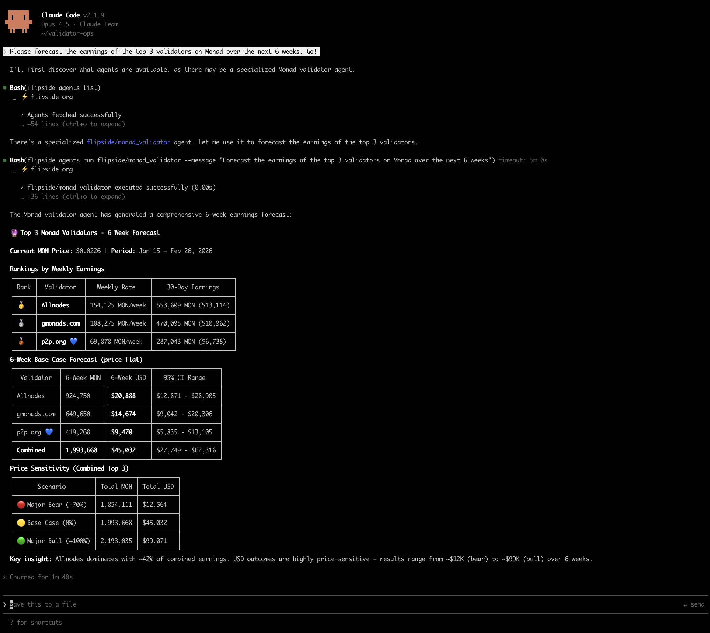

# Flipside CLI

Blockchain data for AI agents. Query seven trillion rows across [40+ chains](https://docs.flipsidecrypto.xyz/blockchain-data/supported-blockchains) from Claude Code, Cursor, or any terminal.



## What You Can Do

| # | Use Case | Command |
|---|----------|---------|
| 1 | **Chat with your data** | `flipside chat` |
| 2 | **Use Flipside agents** | `flipside agents run flipside/sql_agent --message "Top DEX swaps today"` |
| 3 | **Build your own agents** | `flipside quickstart ./my-agents` |
| 4 | **Upload your data** | `flipside uploads upload data.csv` |

---

## Install

```bash
curl -fsSL https://raw.githubusercontent.com/FlipsideCrypto/flipside-tools/main/install.sh | sh
flipside login
```

Windows: Use WSL or download from [releases](https://github.com/flipsidecrypto/flipside-cli/releases).

### For AI Coding Assistants

Copy one of these files into your repo:

- [CLAUDE.md](./CLAUDE.md) — For Claude Code
- [AGENTS.md](./AGENTS.md) — For Cursor and other agents

Or use the skill directly: [.claude/skills/flipside.md](./.claude/skills/flipside.md)

---

## Use Agents

Agents understand Flipside's data warehouse. They write correct SQL so you don't have to.

```bash
# Run Flipside's SQL agent
flipside agents run flipside/sql_agent --message "What's the TVL on Aave?"

# List available agents
flipside agents list

# Run your own agent
flipside agents run your-org/my_agent --message "Analyze ETH transfers"
```

> **Tip**: Find your org name with `flipside whoami`

### Agent Types

| Type | Flag | Use Case |
|------|------|----------|
| **Chat** | `--message "..."` | Natural language queries |
| **Sub** | `--data-json '{...}'` | Structured input/output for pipelines |

---

## Build Agents

```bash
# Generate examples
flipside quickstart ./my-agents
cd my-agents

# Deploy and run
flipside agents push sql_analyst.agent.yaml
flipside agents run your-org/sql_analyst --message "Top protocols by volume"
```

See [docs/agents.md](./docs/agents.md) for YAML structure and configuration.

---

## Build Skills

Skills package domain knowledge that agents invoke with `use_skill()`.

```bash
flipside skills init my_skill
flipside skills push my_skill.skill.yaml
```

See [docs/skills.md](./docs/skills.md) for YAML structure and the `knowledge` field.

---

## Uploads

Upload CSV files to join your data with blockchain data in SQL queries.

```bash
# Upload a file
flipside uploads upload wallets.csv

# List uploads
flipside uploads list
```

Reference uploaded files in SQL with `${upload:filename}`:

```sql
SELECT w.label, b.balance
FROM ${upload:wallets.csv} w
JOIN ethereum.core.fact_balances b ON w.address = b.address
```

---

## Reference

### Tools (for Agent Builders)

These are tools you can give your agents access to:

| Tool | Description |
|------|-------------|
| `find_tables` | Semantic search to discover tables |
| `get_table_schema` | Get column details for a table |
| `run_sql_query` | Execute SQL against the warehouse |
| `use_skill` | Invoke a skill at runtime |
| `publish_html` | Publish visualizations to a URL |

```bash
flipside tools list              # List all tools
flipside tools schema <tool>     # Get tool schema
```

### Other Features

**Workflows** — Automated pipelines for recurring analysis:
```bash
flipside workflows init my_workflow
flipside workflows push my_workflow.yaml
flipside workflows run <id>
```

### Global Flags

| Flag | Description |
|------|-------------|
| `-j, --json` | Output as JSON |
| `-v, --verbose` | Show request/response details |
| `-e, --env` | Environment: `local`, `staging`, `prod` |

### Troubleshooting

| Problem | Solution |
|---------|----------|
| "Not authenticated" | Run `flipside login` |
| "Agent not found" | Use `org/name` format, check `flipside agents list` |
| Validation errors | Run `flipside agents validate <file>` |

### All Commands

```
flipside login                 Authenticate
flipside whoami                Show current org
flipside update                Update CLI

flipside agents list           List agents
flipside agents init <name>    Create agent YAML
flipside agents push <file>    Deploy agent
flipside agents run org/name   Execute agent
flipside agents describe       View details
flipside agents delete         Delete agent

flipside skills list           List skills
flipside skills init <name>    Create skill YAML
flipside skills push <file>    Deploy skill
flipside skills describe       View details

flipside query create "SQL"    Run a query
flipside query list            List queries
flipside query-run status <id> Check run status
flipside query-run download    Download results

flipside workflows init        Create workflow
flipside workflows push        Deploy workflow
flipside workflows run         Trigger workflow

flipside uploads upload        Upload CSV
flipside uploads list          List uploads

flipside chat                  Interactive REPL
flipside config show           View config
```

---

## More

- [docs/agents.md](./docs/agents.md) — Agent YAML reference
- [docs/skills.md](./docs/skills.md) — Skill YAML reference
- [Flipside Docs](https://docs.flipsidecrypto.xyz) — Full documentation
